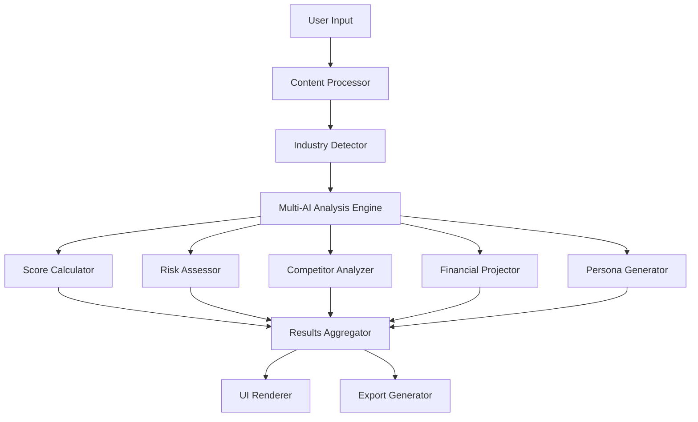

# Enhanced Analysis Methodology Design Document

## Overview

The Enhanced Analysis Methodology transforms Validationly from a simple validation tool into a comprehensive AI-powered business intelligence platform. This design implements a 10-dimensional analysis system that provides entrepreneurs with deep, actionable insights through sophisticated AI analysis, industry-specific frameworks, and structured validation roadmaps.

## Architecture

### High-Level Architecture



### Core Components

#### 1. Enhanced Analysis Engine
- **Multi-Dimensional Scorer**: Calculates 5 separate scores using AI analysis
- **Industry Classifier**: Automatically detects business category and applies specific frameworks
- **Risk Matrix Generator**: Evaluates 5 risk categories with mitigation strategies
- **Competitor Intelligence**: Simulates market research and competitive analysis

#### 2. AI Orchestration Layer
- **Primary AI**: Gemini 2.0 Flash Experimental for main analysis
- **Fallback AI**: Gemini 1.5 Flash for reliability
- **Specialized Prompts**: Industry-specific and analysis-type-specific prompts
- **Response Validation**: Ensures consistent, structured outputs

#### 3. Data Processing Pipeline
- **Input Sanitization**: Validates and cleans user input
- **Language Detection**: Maintains consistent language throughout analysis
- **Context Enhancement**: Enriches analysis with industry knowledge
- **Result Aggregation**: Combines multiple AI outputs into cohesive insights

## Components and Interfaces

### 1. Enhanced Validation Engine

```typescript
interface EnhancedValidationResult {
  // Core Analysis
  idea: string;
  industry: IndustryCategory;
  overallScore: number;
  
  // Multi-Dimensional Scoring
  dimensionalScores: {
    marketSize: number;
    competitionIntensity: number;
    technicalFeasibility: number;
    monetizationPotential: number;
    timingTrend: number;
  };
  
  // Risk Assessment
  riskMatrix: {
    technical: RiskLevel;
    market: RiskLevel;
    financial: RiskLevel;
    regulatory: RiskLevel;
    execution: RiskLevel;
  };
  
  // Competitor Intelligence
  competitorAnalysis: {
    majorPlayers: string[];
    marketGaps: string[];
    differentiationOpportunities: string[];
    competitiveAdvantages: string[];
  };
  
  // Financial Projections
  financialProjections: {
    revenueProjection: YearlyProjection[];
    costStructure: CostBreakdown;
    breakEvenTimeline: string;
    fundingRequirements: FundingStage[];
  };
  
  // Platform Analysis
  platformAnalysis: {
    twitter: PlatformScore;
    reddit: PlatformScore;
    linkedin: PlatformScore;
    tiktok: PlatformScore;
    productHunt: PlatformScore;
  };
  
  // Persona Analysis
  personaAnalysis: PersonaInsight[];
  
  // Validation Roadmap
  validationRoadmap: {
    criticalAssumptions: Assumption[];
    experiments: ValidationExperiment[];
    timeline: ValidationTimeline;
  };
  
  // Actionable Steps
  nextSteps: {
    week1: ActionItem[];
    week2: ActionItem[];
    week3: ActionItem[];
    week4: ActionItem[];
  };
  
  // Market Timing
  timingAnalysis: {
    currentReadiness: number;
    optimalTiming: string;
    marketConditions: string[];
    recommendations: string[];
  };
}
```

### 2. Industry-Specific Analysis Framework

```typescript
interface IndustryFramework {
  category: IndustryCategory;
  scoringWeights: {
    marketSize: number;
    competition: number;
    technical: number;
    monetization: number;
    timing: number;
  };
  specificConsiderations: string[];
  regulatoryFactors: string[];
  keyMetrics: string[];
  successPatterns: string[];
}

enum IndustryCategory {
  SAAS_TECH = 'saas_tech',
  ECOMMERCE = 'ecommerce',
  HEALTH_FITNESS = 'health_fitness',
  EDUCATION = 'education',
  FINTECH = 'fintech',
  MARKETPLACE = 'marketplace',
  CONSUMER_APP = 'consumer_app',
  B2B_SERVICES = 'b2b_services',
  HARDWARE = 'hardware',
  CONTENT_MEDIA = 'content_media'
}
```

### 3. AI Prompt Engineering System

```typescript
interface PromptTemplate {
  basePrompt: string;
  industrySpecificAddons: Record<IndustryCategory, string>;
  analysisTypeModifiers: Record<AnalysisType, string>;
  languageInstructions: string;
  outputFormatting: string;
}

enum AnalysisType {
  DIMENSIONAL_SCORING = 'dimensional_scoring',
  RISK_ASSESSMENT = 'risk_assessment',
  COMPETITOR_ANALYSIS = 'competitor_analysis',
  FINANCIAL_PROJECTION = 'financial_projection',
  PERSONA_ANALYSIS = 'persona_analysis',
  VALIDATION_ROADMAP = 'validation_roadmap'
}
```

## Data Models

### 1. Enhanced Result Schema

```typescript
interface DimensionalScore {
  score: number; // 0-100
  reasoning: string;
  keyFactors: string[];
  improvementAreas: string[];
}

interface RiskAssessment {
  level: 'Low' | 'Medium' | 'High';
  description: string;
  mitigationStrategies: string[];
  impact: number; // 1-10
  probability: number; // 1-10
}

interface PersonaInsight {
  name: string;
  description: string;
  adoptionLikelihood: number; // 0-100
  keyConcerns: string[];
  persuasionStrategies: string[];
  valueProposition: string;
}

interface ValidationExperiment {
  assumption: string;
  experimentType: string;
  description: string;
  successCriteria: string;
  failureCriteria: string;
  requiredSampleSize: number;
  estimatedCost: string;
  timeframe: string;
}

interface ActionItem {
  task: string;
  description: string;
  successCriteria: string;
  requiredResources: string[];
  timeEstimate: string;
  priority: 'High' | 'Medium' | 'Low';
}
```

### 2. Industry Knowledge Base

```typescript
interface IndustryKnowledge {
  category: IndustryCategory;
  marketSize: string;
  growthRate: string;
  keyPlayers: string[];
  commonChallenges: string[];
  successFactors: string[];
  regulatoryEnvironment: string;
  typicalTimelines: {
    mvp: string;
    marketEntry: string;
    profitability: string;
  };
  fundingPatterns: {
    seed: string;
    seriesA: string;
    growth: string;
  };
}
```

## Error Handling

### 1. AI Response Validation
- **Schema Validation**: Ensure all required fields are present
- **Data Type Checking**: Validate score ranges and data types
- **Content Quality**: Check for meaningful, non-generic responses
- **Language Consistency**: Verify response language matches input

### 2. Fallback Mechanisms
- **Primary AI Failure**: Automatic fallback to Gemini 1.5
- **Partial Analysis**: Continue with available data if some components fail
- **Default Values**: Provide reasonable defaults for missing analysis components
- **User Notification**: Inform users about any limitations in the analysis

### 3. Rate Limiting and Performance
- **Request Throttling**: Implement intelligent rate limiting
- **Caching Strategy**: Cache industry frameworks and common analyses
- **Timeout Handling**: Graceful handling of AI response timeouts
- **Resource Management**: Monitor and optimize AI token usage

## Testing Strategy

### 1. Unit Testing
- **Component Testing**: Test each analysis component independently
- **AI Response Parsing**: Validate JSON parsing and schema compliance
- **Score Calculation**: Test dimensional scoring algorithms
- **Industry Classification**: Verify industry detection accuracy

### 2. Integration Testing
- **End-to-End Analysis**: Test complete analysis pipeline
- **AI Model Integration**: Verify both primary and fallback AI models
- **Data Flow**: Ensure proper data flow between components
- **Error Propagation**: Test error handling across the system

### 3. User Experience Testing
- **Performance Testing**: Ensure analysis completes within acceptable time
- **Mobile Responsiveness**: Test complex UI on various devices
- **Accessibility**: Verify screen reader compatibility and keyboard navigation
- **Cross-Browser**: Test visualization components across browsers

### 4. AI Quality Testing
- **Prompt Effectiveness**: Test prompts across different idea types
- **Response Consistency**: Verify consistent quality across multiple runs
- **Language Support**: Test Turkish and English language consistency
- **Industry Accuracy**: Validate industry-specific analysis quality

## Implementation Phases

### Phase 1: Core Multi-Dimensional Analysis
- Implement 5-dimensional scoring system
- Add industry detection and classification
- Create enhanced UI for dimensional scores
- Basic risk assessment implementation

### Phase 2: Intelligence Features
- Competitor analysis simulation
- Financial projections generator
- Platform-specific deep dive analysis
- Enhanced error handling and fallbacks

### Phase 3: Advanced Planning Tools
- Persona-based analysis
- Validation roadmap generator
- Actionable next steps planning
- Market timing analysis

### Phase 4: User Experience Enhancement
- Advanced visualizations and charts
- Export and sharing functionality
- Mobile optimization
- Performance optimization

### Phase 5: Analytics and Optimization
- Usage analytics and insights
- AI prompt optimization based on feedback
- A/B testing for different analysis approaches
- Advanced caching and performance tuning

## Security and Privacy Considerations

### 1. Data Protection
- **Input Sanitization**: Prevent injection attacks and malicious input
- **PII Detection**: Identify and handle personally identifiable information
- **Data Retention**: Implement appropriate data retention policies
- **Encryption**: Encrypt sensitive data in transit and at rest

### 2. AI Safety
- **Content Filtering**: Prevent generation of harmful or inappropriate content
- **Bias Mitigation**: Monitor and address potential AI biases in analysis
- **Output Validation**: Ensure AI outputs are appropriate and helpful
- **Rate Limiting**: Prevent abuse and ensure fair usage

### 3. Export Security
- **Access Control**: Secure sharing links with proper authentication
- **Data Anonymization**: Remove sensitive information from exports
- **Audit Logging**: Track access to shared analyses
- **Expiration Management**: Automatic cleanup of expired shared content