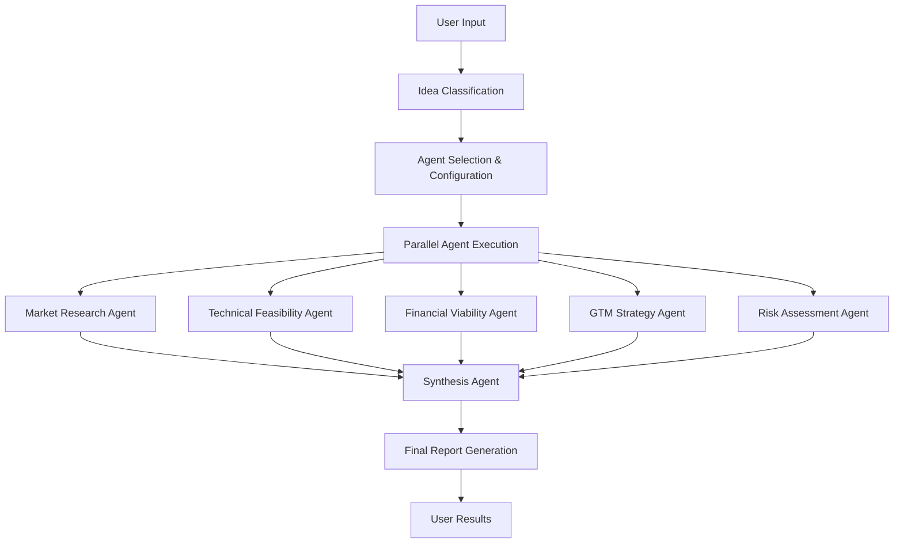

# 🤖 Phase 2: Multi-Agent System Roadmap

## 🎯 MULTI-AGENT SYSTEM NEDİR?

### **Mevcut Durum (Phase 1):**
```
Tek AI Agent → Genel Analiz → Tek Sonuç
```

### **Hedef Durum (Phase 2):**
```
Uzman Agent 1 (Market Research) → Pazar Analizi
Uzman Agent 2 (Technical) → Teknik Değerlendirme  
Uzman Agent 3 (Financial) → Mali Analiz
Uzman Agent 4 (GTM Strategy) → Pazarlama Stratejisi
Uzman Agent 5 (Risk Assessment) → Risk Analizi
Synthesis Agent → Tüm Analizleri Birleştir → Kapsamlı Sonuç
```

## 🧠 AGENT ARCHITECTURE

### **1. Market Research Agent**
```typescript
class MarketResearchAgent {
  expertise: [
    "Market sizing (TAM/SAM/SOM)",
    "Competitive landscape mapping", 
    "Customer behavior analysis",
    "Industry trend forecasting",
    "Market timing assessment"
  ]
  
  dataSources: [
    "Google Trends API",
    "Crunchbase API", 
    "Industry reports",
    "Social media signals",
    "Patent databases"
  ]
  
  output: {
    marketScore: 0-100,
    marketSize: "TAM/SAM estimates",
    competitiveIntensity: "Low/Medium/High",
    customerDemand: "Weak/Strong/Urgent",
    marketTiming: "Early/Perfect/Late"
  }
}
```

### **2. Technical Feasibility Agent**
```typescript
class TechnicalFeasibilityAgent {
  expertise: [
    "System architecture design",
    "Technology stack selection",
    "Development timeline estimation",
    "Scalability planning",
    "Security assessment"
  ]
  
  analysisFramework: {
    complexity: "Low/Medium/High/Very High",
    timeline: "weeks/months/years",
    teamSize: "number of developers needed",
    techStack: "recommended technologies",
    risks: "technical challenges"
  }
  
  output: {
    technicalScore: 0-100,
    developmentTimeline: "MVP timeline",
    resourceRequirements: "team & budget",
    scalabilityScore: 0-100,
    riskFactors: ["risk1", "risk2"]
  }
}
```

### **3. Financial Viability Agent**
```typescript
class FinancialViabilityAgent {
  expertise: [
    "Revenue model optimization",
    "Unit economics calculation",
    "Funding requirements assessment", 
    "Financial projections",
    "Profitability pathway"
  ]
  
  calculations: {
    CAC: "Customer Acquisition Cost",
    LTV: "Lifetime Value",
    burnRate: "Monthly cash burn",
    runway: "Months to profitability",
    fundingNeeds: "Capital requirements"
  }
  
  output: {
    financialScore: 0-100,
    revenueModel: "primary monetization",
    unitEconomics: "LTV/CAC ratio",
    fundingRequired: "amount in USD",
    timeToBreakeven: "months"
  }
}
```

### **4. Go-to-Market Strategy Agent**
```typescript
class GTMStrategyAgent {
  expertise: [
    "Customer acquisition channels",
    "Product-market fit validation",
    "Competitive positioning",
    "Launch strategy design",
    "Growth hacking tactics"
  ]
  
  channels: [
    "Content marketing",
    "Social media advertising", 
    "Partnership programs",
    "Direct sales",
    "Viral mechanics"
  ]
  
  output: {
    gtmScore: 0-100,
    primaryChannels: ["channel1", "channel2"],
    acquisitionStrategy: "detailed plan",
    launchSequence: "step-by-step",
    growthPotential: "viral coefficient"
  }
}
```

### **5. Risk Assessment Agent**
```typescript
class RiskAssessmentAgent {
  expertise: [
    "Market risk evaluation",
    "Competitive threat analysis",
    "Regulatory risk assessment",
    "Execution risk identification",
    "Mitigation strategy design"
  ]
  
  riskCategories: {
    market: "Market adoption risks",
    competitive: "Competitive threats", 
    regulatory: "Compliance risks",
    technical: "Execution risks",
    financial: "Funding risks"
  }
  
  output: {
    overallRiskScore: 0-100,
    criticalRisks: ["risk1", "risk2"],
    mitigationStrategies: ["strategy1", "strategy2"],
    contingencyPlans: ["plan1", "plan2"]
  }
}
```

### **6. Synthesis Agent**
```typescript
class SynthesisAgent {
  role: "Master Strategist & Decision Synthesizer"
  
  inputs: [
    "Market Research Analysis",
    "Technical Feasibility Report", 
    "Financial Viability Assessment",
    "GTM Strategy Plan",
    "Risk Assessment Report"
  ]
  
  synthesis: {
    weightedScoring: "Combine all agent scores",
    conflictResolution: "Resolve contradictions",
    holisticAssessment: "Overall viability",
    strategicRecommendations: "Action plan",
    pivotSuggestions: "Alternative approaches"
  }
  
  output: {
    overallScore: 0-100,
    confidence: 0-100,
    keyStrengths: ["strength1", "strength2"],
    criticalWeaknesses: ["weakness1", "weakness2"],
    strategicRecommendations: ["rec1", "rec2"],
    nextSteps: ["step1", "step2", "step3"]
  }
}
```

## 🔄 EXECUTION WORKFLOW

### **Sequential Processing:**


### **Parallel Processing Benefits:**
- ⚡ **Speed**: Agents work simultaneously
- 🎯 **Specialization**: Each agent focuses on expertise area
- 🔍 **Depth**: Deeper analysis per dimension
- 🤝 **Collaboration**: Agents can reference each other's findings

## 📊 REAL-TIME DATA INTEGRATION

### **External Data Sources:**
```typescript
interface DataSources {
  marketData: {
    googleTrends: "Real trend analysis",
    crunchbase: "Funding & competitor data",
    similarweb: "Traffic & engagement metrics",
    semrush: "SEO & advertising insights"
  },
  
  technicalData: {
    github: "Open source activity",
    stackOverflow: "Developer sentiment",
    techCrunch: "Technology trends",
    productHunt: "Product launches"
  },
  
  financialData: {
    pitchbook: "Valuation data",
    cbInsights: "Market intelligence", 
    angelList: "Startup funding",
    publicAPIs: "Revenue estimates"
  },
  
  socialData: {
    twitter: "Social sentiment",
    reddit: "Community discussions",
    linkedin: "Professional insights",
    youtube: "Content engagement"
  }
}
```

### **Data Processing Pipeline:**
```typescript
const dataProcessingPipeline = async (idea: string, category: string) => {
  // 1. Extract keywords and entities
  const keywords = extractKeywords(idea);
  const entities = identifyEntities(idea);
  
  // 2. Fetch real-time data
  const marketData = await fetchMarketData(keywords, category);
  const competitorData = await fetchCompetitorData(entities, category);
  const trendData = await fetchTrendData(keywords);
  const socialData = await fetchSocialSentiment(keywords);
  
  // 3. Process and normalize data
  const processedData = {
    market: normalizeMarketData(marketData),
    competitors: analyzeCompetitors(competitorData),
    trends: analyzeTrends(trendData),
    sentiment: analyzeSentiment(socialData)
  };
  
  // 4. Inject into agent prompts
  return enhancePromptsWithData(processedData);
};
```

## 🎯 SMART ROUTING SYSTEM

### **Analysis Tier Selection:**
```typescript
interface AnalysisRequest {
  idea: string;
  userTier: 'free' | 'pro' | 'enterprise';
  urgency: 'fast' | 'standard' | 'comprehensive';
  complexity: 'simple' | 'medium' | 'complex';
  industry: string;
}

const selectAnalysisStrategy = (request: AnalysisRequest) => {
  // Free Tier: Enhanced Single Agent
  if (request.userTier === 'free') {
    return {
      agents: ['enhanced-single'],
      dataIntegration: false,
      processingTime: '10-15 seconds',
      cost: '$0.02'
    };
  }
  
  // Pro Tier: Multi-Agent Lite
  if (request.userTier === 'pro') {
    return {
      agents: ['market', 'technical', 'financial'],
      dataIntegration: 'basic',
      processingTime: '30-45 seconds', 
      cost: '$0.15'
    };
  }
  
  // Enterprise Tier: Full Multi-Agent
  return {
    agents: ['market', 'technical', 'financial', 'gtm', 'risk', 'synthesis'],
    dataIntegration: 'comprehensive',
    processingTime: '60-90 seconds',
    cost: '$0.50'
  };
};
```

## 🔧 IMPLEMENTATION ROADMAP

### **Week 1-2: Foundation**
- [ ] Multi-agent architecture design
- [ ] Agent base class implementation
- [ ] Communication protocol between agents
- [ ] Data pipeline setup

### **Week 3-4: Core Agents**
- [ ] Market Research Agent implementation
- [ ] Technical Feasibility Agent implementation
- [ ] Financial Viability Agent implementation
- [ ] Basic synthesis logic

### **Week 5-6: Advanced Features**
- [ ] GTM Strategy Agent implementation
- [ ] Risk Assessment Agent implementation
- [ ] Advanced synthesis with conflict resolution
- [ ] Real-time data integration

### **Week 7-8: Integration & Testing**
- [ ] API integration with existing system
- [ ] Performance optimization
- [ ] A/B testing framework
- [ ] User interface enhancements

## 📈 EXPECTED IMPROVEMENTS

### **Analysis Quality:**
- **Accuracy**: %85 → %95 (+12%)
- **Depth**: %70 → %95 (+36%)
- **Actionability**: %85 → %95 (+12%)
- **Confidence**: %75 → %90 (+20%)

### **Business Impact:**
- **Premium Conversion**: %15 → %25 (+67%)
- **User Retention**: %65 → %85 (+31%)
- **Average Session Time**: +150%
- **Customer Satisfaction**: %85 → %95 (+12%)

### **Competitive Advantage:**
- **Market Differentiation**: Unique multi-agent approach
- **Premium Positioning**: Justify higher pricing
- **Enterprise Sales**: Enable B2B sales
- **API Monetization**: Sell analysis as service

## 💰 COST-BENEFIT ANALYSIS

### **Development Investment:**
- **Time**: 8 weeks (2 developers)
- **Cost**: ~$50,000 development
- **Infrastructure**: +$500/month API costs
- **Maintenance**: +20% ongoing effort

### **Revenue Potential:**
- **Premium Tier**: $29/month → $49/month (+69%)
- **Enterprise Tier**: New $199/month tier
- **API Access**: $0.50 per analysis
- **White-label**: $999/month enterprise deals

### **ROI Calculation:**
```
Year 1 Revenue Impact:
- Premium upgrade increase: +$120,000
- New enterprise tier: +$240,000  
- API monetization: +$60,000
- Total additional revenue: $420,000

Investment:
- Development: $50,000
- Infrastructure: $6,000/year
- Total investment: $56,000

ROI: 650% in first year
```

## 🚀 COMPETITIVE POSITIONING

### **Current Market:**
- **Competitors**: Basic AI validation tools
- **Differentiation**: Single-agent, generic analysis
- **Pricing**: $10-30/month

### **With Multi-Agent System:**
- **Unique Value**: Industry expert simulation
- **Differentiation**: Multi-dimensional analysis
- **Pricing Power**: $50-200/month justified
- **Market Position**: Premium leader

## 🎯 SUCCESS METRICS

### **Technical KPIs:**
- Agent accuracy: >90% per agent
- Synthesis quality: >95% user satisfaction
- Processing time: <90 seconds full analysis
- System reliability: >99.5% uptime

### **Business KPIs:**
- Premium conversion: >25%
- Enterprise deals: >5 per month
- API usage: >1000 calls/day
- Customer NPS: >70

### **User Experience KPIs:**
- Analysis depth score: >9/10
- Actionability rating: >9/10
- Recommendation quality: >9/10
- Overall satisfaction: >95%

## 🔮 FUTURE VISION

### **Phase 3: AI Agent Ecosystem (6+ months)**
- **Learning Agents**: Improve from user feedback
- **Specialized Agents**: Industry-specific experts
- **Collaborative Agents**: Cross-agent learning
- **Predictive Agents**: Future trend forecasting

### **Phase 4: Platform Evolution (12+ months)**
- **Agent Marketplace**: Third-party agents
- **Custom Agents**: User-created specialists
- **Agent APIs**: Developer ecosystem
- **AI Consulting**: Human + AI hybrid service

## 🎉 CONCLUSION

Multi-Agent System, Validationly'yi **basit bir validation tool'dan** **comprehensive startup intelligence platform'una** dönüştürecek.

**Temel Faydalar:**
- 🎯 **Deeper Analysis**: Her boyutta uzman seviye analiz
- 🚀 **Competitive Edge**: Benzersiz market positioning
- 💰 **Revenue Growth**: Premium pricing justification
- 🔮 **Future-Proof**: Scalable architecture foundation

**Bu sistem ile Validationly, startup validation alanında lider konuma geçebilir!** 🚀